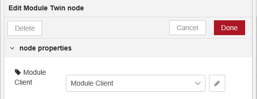
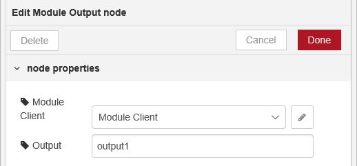
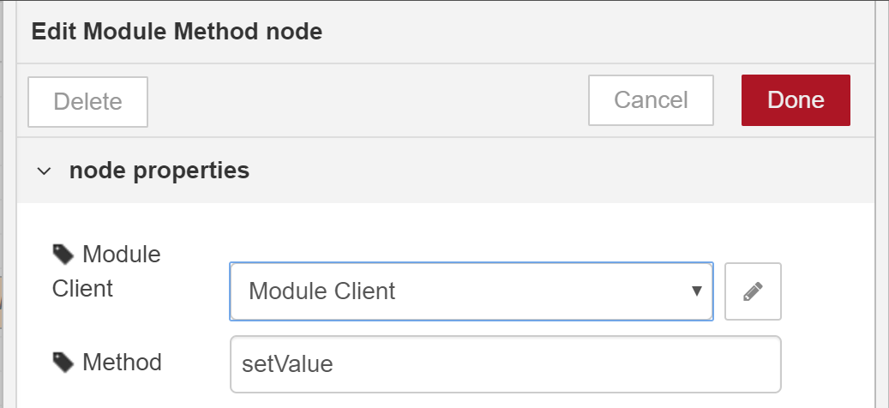
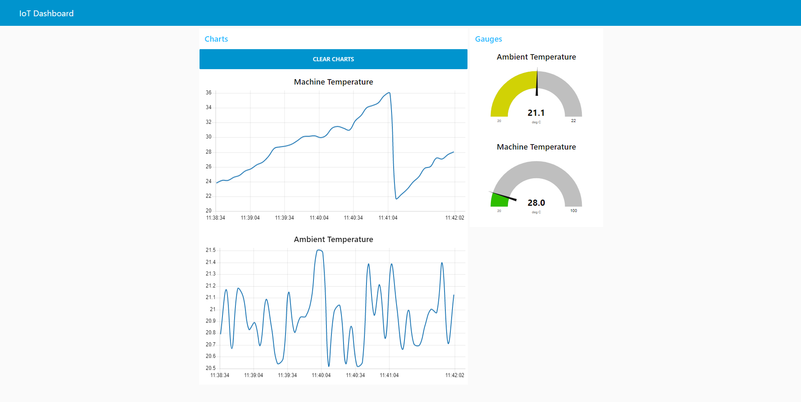

# Azure IoT Edge Node-RED Module
The Azure IoT Edge Node-RED Module is a module that can be deployed to Azure IoT Edge so you can interact with the IoT Edge platform using Node-RED. This module is provided "as-is", without any guarantee. The module can be found on [Docker Hub](https://hub.docker.com/r/iotblackbelt/noderededgemodule/) and the source code can be found in the *node-red-contrib-azure-iot-edge-module* directory of this repository. If you want to create your own Node-RED module, just follow the steps that can be found in our documentation to create a [Node.js IoT Edge module](https://docs.microsoft.com/en-us/azure/iot-edge/tutorial-node-module) and use the Node.js code provided in this repository.


## How to deploy the module

The module is available as an AMD64, ARM64 and ARM32 module. To run the module, deploy an [IoT Edge on Linux](https://docs.microsoft.com/en-us/azure/iot-edge/how-to-install-iot-edge-linux) or [Raspberry Pi](https://docs.microsoft.com/en-us/azure/iot-edge/how-to-install-iot-edge-linux-arm), and then deploy the respective module (AMD64, ARM64v8 or ARM32V7):

- In the Azure portal, navigate to your IoT hub.
- Go to **IoT Edge** and select your IoT Edge device.
- Select **Set Modules**.
- In the **Deployment Modules** section of the page, click **Add** then select **IoT Edge Module**.
- In the **Name** field, enter ```nodered```. 
- In the **Image URI** field, enter ```iotblackbelt/noderededgemodule:1.0.1-amd64```, ```iotblackbelt/noderededgemodule:1.0.1-arm64v8``` or ```iotblackbelt/noderededgemodule:1.0.1-arm32v7```. 
- Set the Container Create Options and select **Save**.
    ```json
    {
      "HostConfig": {
        "Privileged": true,
        "Binds":[
            "/node-red:/node-red"
        ],
        "PortBindings": {
          "1880/tcp": [
            {
              "HostPort": "1880"
            }
          ]
        }
      }
    }
    ```

  If you want to use physical inputs and outputs on your device (f.i. GPIO on Raspberry Pi) you need to make sure these physical devices are exposed to the module as part of the configuration options. In the create options we've set "Privileged" to true, giving you access to all underlying hardware devices.

  > **NB:** If you are deploying to a Raspberry Pi ARM32v7 please ensure that you add the $edgeHub environment variable "OptimizeForPerformance":"false" to the deployment, using the **Runtime Settings** tab.

- On the IoT Edge device create a **/node-red** directory. This directory will hold the changes made to the Node-RED settings and custom flows created.

- Back in the **Add modules** step, select **Next**.

- In the **Specify routes** step, you should have a default route that sends all messages from all modules to IoT Hub. If not, add the following code then select **Next**.

  ```json
  {
      "routes": {
          "route": "FROM /messages/* INTO $upstream"
      }
  }
  ```
- In the **Review Deployment** step, select **Submit**.

- Return to the device details page and select **Refresh**. In addition to the edgeAgent module that was created when you first started the service, you should see another runtime module called **edgeHub** and the **tempSensor** module listed. 

Once the module is running you can access Node-RED through the browser on the same network as the edge device using the IP address or network name and port number 1880: http://&#x3C;edge-device-ip&#x3E;:1880

## Use the tempSensor to simulate a device
If you want to simulate a device sending data on the IoT Edge you can deploy the tempSensor module. For more information on how to do this please check out: https://docs.microsoft.com/en-us/azure/iot-edge/how-to-install-iot-edge-linux-arm.

An example of a route that can be used to validate sending input to the Node-RED module:
```
{
  "routes": {
    "routeToHub": "FROM /messages/modules/{noderedmodule}/outputs/* INTO $upstream",
    "tempToRed": "FROM /messages/modules/tempSensor/* INTO BrokeredEndpoint(\"/modules/{noderedmodule}/inputs/input1\")"
  }
}
```
Replace {noderedmodule} with the name of the Node-RED module you created.

## Module nodes
The Node-RED module contains a number of custom nodes placed in the group "Azure IoT Edge". These nodes are "Module Twin", "Module Input", "Module Output", and "Module Method". These nodes represent the interaction that can be done with an Azure IoT Edge Module:

- **Module Client:**

  The Module Client is a configuration node that needs to be created to make the connection between the IoT Edge and the Node-RED Azure IoT Edge nodes. If you use one of the examples a Module Client will be created automatically.

  > **NB:** Only one Module Client node should be used when using the Node-RED module.

- **Module Twin:**

  The Module Twin enables you to interact with the module twin on IoT Hub. The node output will provide the twin desired property changes and the node input will enable you to send reported properties back to the IoT Hub. The message coming from the node output will have the property "topic: desired" added to it for selection and identification purposes.
  The Module Twin only needs a connection to a Module Client: 

  

- **Module Input:**

  The Module Input enables you to receive input from other modules on your IoT Edge device. To receive input, you have to setup the route to point at the input you specified when you created the node. The node output will provide you with the incoming telemetry message. The message coming from the node output will have the properties "topic: input" and "input: &#x3C;input name&#x3E;" added to it for selection and identification purposes.

  The Module Input needs a connection to a Module Client and the name of the "input": 

  

- **Module Output:**

  The Module Output enables you to send output to the edgeHub. To send output to another module or to the IoT Hub you have to setup the route to use the output when you created the node. The node input will enable you to send the telemetry message. 
  The Module Output needs a connection to a Module Client and the name of the "output":

  

- **Module Method:**

  The Module Method enables you receive module direct methods. The setup of the module defines which method the node is responding to and what the response is for the method call. The message coming from the node output will have the properties "topic: method", "method: &#x3C;method name&#x3E;" and "payload: &#x3C;method payload&#x3E;" added to it for selection and identification purposes.

  The input of the node will have to be used to send a response for the method call. The response (message) wil have to be connected (indirectly) to the message coming from the node output, to ensure a closed loop for the method. When sending a return for the method call on the input, the message property "status: &#x3C;your status&#x3E;" needs to be set on the message. See the function in the example for details.
  The Module Method needs a connection to a Module Client and the name of the "method": 

  


## How to use the module

- Access the Node-RED module using a browser on the same network as the IoT Edge device: http://&#x3C;edge-device-ip&#x3E;:1880
- Open the example as a starter, containing all custom nodes: ```Import > Examples > azure iot-edge > example```
- Deploy the example and see the output either in the debug window of Node-RED or using device explorer on windows for the output messages send to IoT Hub.
  > **NB:** The example assumes you've deployed the tempSensor and related route as mentoined above. The provided deployment templates deploy a setup specifically for the Node-RED example. If you deploy by hand and see no messages coming into the Node-RED module input, check whether you've named the modules and the end-points the same and used them correctly in the route.*
- If you want to deploy more output, input or method nodes you can drag these onto the Node-RED design service and connect them to the Module Client using the existing one as the Nodule Client configuration node in the node settings.
- You can deploy any other Node-RED node if needed and interact with them, but remember you are running in a container and communication with serial ports, etc. might require additional setup of the container host (Moby).
- My assumption is you know how to work with Node-RED, but if you don't you can find Node-RED's documentation here: [https://nodered.org/docs/user-guide/]
- The module includes the dashboard nodes of Node-RED. The example comes with a pre-configured dashboard example: http://&#x3C;edge-device-ip&#x3E;:1880/ui

  
